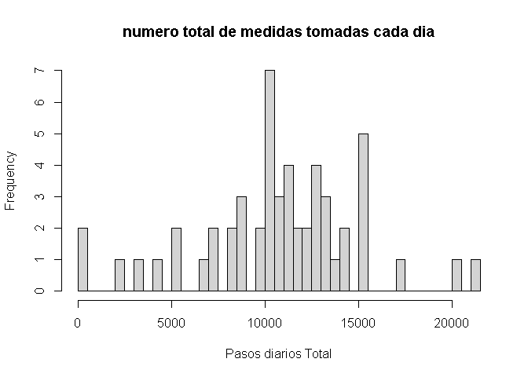
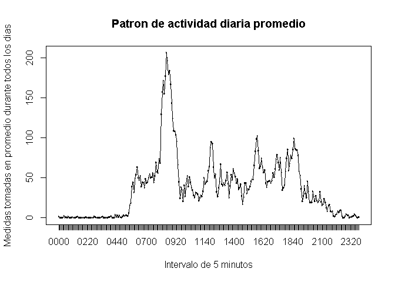
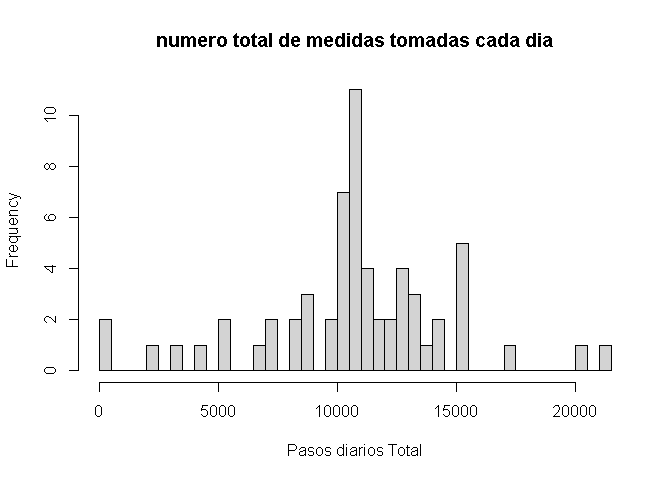
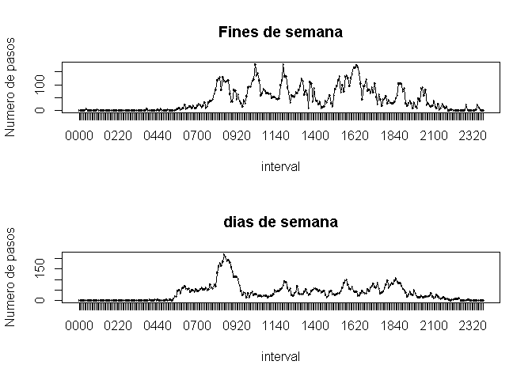

## Loading and preprocessing the data

```r
# cargar los datos

activity<- read.csv('activity.csv',header=TRUE, colClasses=c('numeric','Date','numeric'), na.strings='NA' )

# convertir la columna del intervalo en un factor
activity$interval<- as.factor( sprintf("%02d%02d", activity$interval%/%100, activity$interval%%100) )
# a昼㸱adir una columna de fecha y hora
activity$datetime<-strptime( paste(activity$date,activity$interval), "%F %H%M")
```


## What is mean total number of steps taken per day?

Histograma del numero total de medidas tomadas cada dia:

```r
dailytotals <- aggregate(steps ~ date, data = activity, FUN = sum)
hist(dailytotals$steps, breaks=61, main="numero total de medidas tomadas cada dia", xlab="Pasos diarios Total")
```

<!-- -->
La media del numero total de medidas tomadas por dia es: 

```r
mean(dailytotals$steps)
```

```
## [1] 10766.19
```
La mediana del numero total de medidas tomadas por dia es: 

```r
median(dailytotals$steps)
```

```
## [1] 10765
```


## What is the average daily activity pattern?


```r
meanintervalsteps <- aggregate(steps ~ interval, data=activity, FUN=mean)
plot(meanintervalsteps, type="b", main="Patron de actividad diaria promedio", xlab="Intervalo de 5 minutos", ylab="Medidas tomadas en promedio durante todos los dias")
lines(meanintervalsteps)
```

<!-- -->

El maximo numero de pasos se da durante este intervalo de 5 minutos:

```r
meanintervalsteps[ which.max(meanintervalsteps$steps) ,  ]
```

```
##     interval    steps
## 104     0835 206.1698
```


## Imputing missing values

Hay un numero de dias/intervalos en los que faltan valores (codificados como NA). 

La presencia de dias perdidos puede introducir un sesgo en algunos calculos o resumenes de los datos.

El numero total de valores perdidos en el conjunto de datos (es decir, el numero total de filas con NA) es:

```r
sum(is.na(activity$steps))
```

```
## [1] 2304
```

Para completar todos los valores que faltan en el conjunto de datos, vamos a utilizar la siguiente estrategia: 

Para cualquier fila con un valor de pasos perdidos, sustituimos el valor perdido por el valor medio para el correspondiente intervalo de 5 minutos

```r
matched <- merge(activity, meanintervalsteps, by = "interval")

matched <- matched[order(matched$datetime),]

activity$steps[is.na(activity$steps)] <- matched$steps.y[is.na(activity$steps)]
```

Despues de reemplazar NAs, vamos a trazar el histograma del numero total de pasos dados cada dia :


```r
dailytotals = aggregate(steps ~ date, sum, data = activity)
hist(dailytotals$steps, breaks=61, main="numero total de medidas tomadas cada dia", xlab="Pasos diarios Total")
```

<!-- -->

Despues de reemplazar los NAs, el promedio total de medidas tomadas por dia es: 

```r
mean(dailytotals$steps)
```

```
## [1] 10766.19
```

Despues de reemplazar los NAs, la mediana del numero total de medidas tomadas por dia es : 

```r
median(dailytotals$steps)
```

```
## [1] 10766.19
```
Estos valores no difieren mucho de las estimaciones de la primera parte de la asignacion.

Imputar los datos que faltan a las estimaciones del numero total diario de pasos da como resultado frecuencias mas altas en el histograma a medida que se dispone de mas valores, pero la media y la mediana se modifican poco. Esto es una buena senal, que valida el enfoque elegido para rellenar los AN. 


## Are there differences in activity patterns between weekdays and weekends?

Usemos el conjunto de datos con los valores faltantes rellenados para esta parte.

Vamos a crear una nueva variable factorial en el conjunto de datos con dos niveles, "dia de la semana" y "fin de semana"
indicando si una fecha determinada es un dia de semana o de fin de semana:

```r
activity$isweekend <- (weekdays(activity$datetime) %in% c("s攼㸱bado", "domingo"))
```

Hagamos una grafica de panel que contenga una grafica de series de tiempo del intervalo de 5 minutos (eje x) y el numero promedio de pasos dados, promediado a traves de todos los dias de la semana o los dias de fin de semana (eje y):

```r
meanintervalstepsweekends = aggregate(steps ~ interval, mean, data = activity[ activity$isweekend,] )
meanintervalstepsweekdays = aggregate(steps ~ interval, mean, data = activity[!activity$isweekend,] )
par(mfrow = c(2, 1))
plot(meanintervalstepsweekends, main = "Fines de semana",  ylab="Numero de pasos")
lines(meanintervalstepsweekends)
plot(meanintervalstepsweekdays, main = "dias de semana",  ylab="Numero de pasos")
lines(meanintervalstepsweekdays)
```

<!-- -->
Los dias de fin de semana muestran niveles de actividad repartidos a lo largo del dia, mientras que los dias de la semana tienen un nivel de actividad reducido durante las tipicas horas de oficina.
Tambien la actividad de los dias de semana comienza antes que la de los dias de fin de semana.

